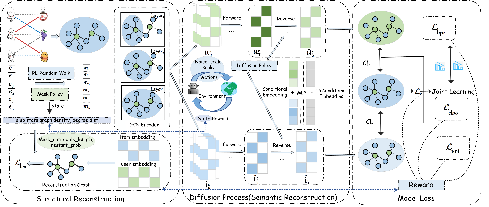

# DAMS
Implementation of our  paper "DAMS: Co-Adaptive Structural Masking and Semantic Diffusion with Dual RL Agents for Recommendation".

This paper proposes a co-adaptive structural Masking and Semantic diffusion with Dual  Agents for Recommendation (DAMS), which integrates contrastive learning to align structural and semantic augmentations. Specifically, two reinforcement learning (RL)–driven policy networks continuously monitor real-time training dynamics to adaptively optimize the core hyperparameters of the respective data augmentation strategies. For main view generation, an RL-driven mask policy performs degree-biased random walks, adaptively controlling walk length and ratio to preserve critical collaborative pathways while eliminating noisy edges. 
For contrastive view generation, an RL-driven diffusion policy dynamically calibrates noise scale and guidance strength. 
A contrastive objective then explicitly aligns the diffusion-reconstructed view with the masked main view, enforcing semantic consistency while compensating for structural loss. 
Both policies are jointly optimized via RL using training loss improvement, forming a closed co-adaptation loop that continuously enhances recommendation performance.

Prerequisites
-------------
* numpy==1.24.4
* scipy==1.15.3
* setproctitle==1.3.3
* torch==2.0.0+cu118
* torch_geometric==2.3.1
* torch_sparse==0.6.17

Usage
------
cd DAMS \
python Main.py --data {ml-1m, yelp, douban}

